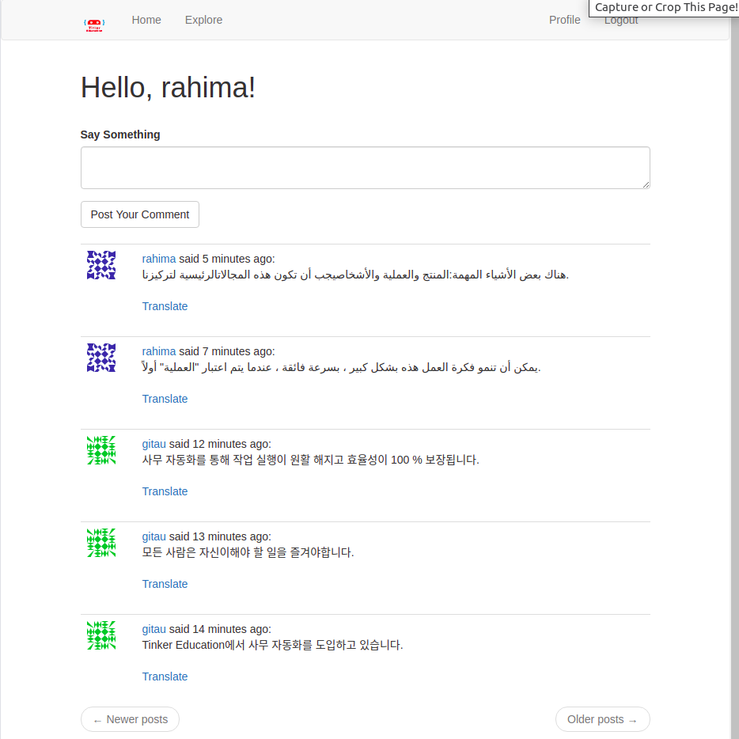

# TinkerChatApp

Welcome to TinkerChatApp. Here, workers can feel free to randomly chat among themselves or with other platform users.

Features available in the app include:

1. New user registration
2. Current user log in
3. Ability to post comments
4. Current user can find other users of th platform
5. Current user can follow and unfollow other platform users
6. Current user can see all the posts that have been posted in the platform
7. Current user can see all the posts of people that they personally follow
8. Current user can see ALL their posts
9. If a post is in a foreign language, their is translation available (however, it is not automatic. Current user can choose to translate it or not.)
10. Local time conversion in a format that is friendly to a user
11. Current user can edit their profile
