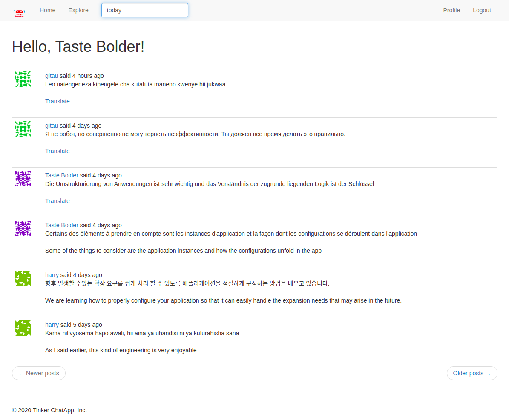

# TinkerChatApp



### Overview
Welcome to TinkerChatApp. Here, workers can feel free to randomly chat among themselves or with other platform users.

### Features:

1. New user registration
2. Current user log in
3. Ability to post comments
4. Current user can find other users of the platform
5. Current user can follow and unfollow other platform users
6. Current user can see all the posts that have been posted in the platform
7. Current user can see all the posts of people that they personally follow
8. Current user can see ALL their posts
9. If a post is in a foreign language, their is translation available (however, it is not automatic. Current user can choose to translate it or not.)
10. Local time conversion in a format that is friendly to a user
11. Current user can edit their profile
12. Current user can search for a post using a keyword
13. Popups on User profile Links
14. Realtime private message updates

### Contributors
* [Gitau Harrison](https://github.com/GitauHarrison)

### Deployed Application

* [Tinker Chat App on Heroku](https://work-gossip-chat-app.herokuapp.com/auth/login)

### Testing

To test the project out, you can clone this repo to your local machine:

```python
$ git clone git@github.com:GitauHarrison/work-gossip-chat-app.git
```

Create and activate your virtual environment before running it:

```python
$ workon work-gossip-app # I am using virtualenvwrapper
```

Install all used dependancies:

```python
(work-gossip-app) $ pip3 install -r requirements.txt
```

Run the application:

```
$ flask run
```